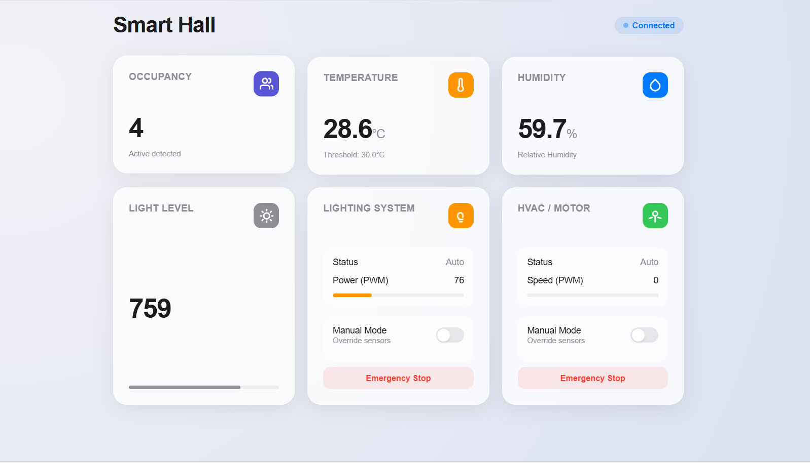

# Smart Hall IoT Automation System


## 📋 Overview

An intelligent hall automation system that monitors occupancy, environmental conditions, and automatically controls lighting and HVAC systems. Features include manual override, emergency stop functionality, and real-time cloud synchronization via Firebase.

## ✨ Key Features

- 🚶 **Occupancy Detection:** Bidirectional IR sensors for accurate people counting
- 🌡️ **Environmental Monitoring:** DHT11 sensor for temperature and humidity
- 💡 **Smart Lighting:** Automatic LED control based on ambient light and occupancy
- 🌀 **HVAC Control:** Temperature and occupancy-based motor/fan speed regulation
- 📱 **Web Dashboard:** Real-time monitoring and control interface
- 🔧 **Manual Override:** Cloud-based manual control with emergency stop
- 🔄 **Auto Mode:** Intelligent automation with sensor-based decision making

## 🔧 Hardware Requirements

### Components List

| Component | Quantity | Specification |
|-----------|----------|---------------|
| NodeMCU ESP8266 | 1 | WiFi-enabled microcontroller |
| DHT11 Sensor | 1 | Temperature & Humidity |
| IR Obstacle Sensors | 2 | People counting (IN/OUT) |
| LDR (Light Sensor) | 1 | Ambient light detection |
| LED (with resistor) | 1 | 220Ω resistor recommended |
| DC Motor/Fan | 1 | 5V DC Motor |
| Resistors | 2 | 10kΩ for pull-up/pull-down |
| Breadboard | 1 | For prototyping |
| Jumper Wires | - | Male-to-Male, Male-to-Female |
| Power Supply | 1 | 5V 2A adapter |

## 📊 Pin Configuration

### Detailed Wiring Table

| Component | Component Pin | NodeMCU Pin | GPIO | Arduino Pin | Notes |
|-----------|---------------|-------------|------|-------------|-------|
| **DHT11 Sensor** |
| VCC | VCC | 3.3V | - | - | Power supply |
| Data | OUT | D2 | GPIO4 | 4 | Data line (with 10kΩ pull-up) |
| GND | GND | GND | - | - | Ground |
| **IR Sensor (IN)** |
| VCC | VCC | 3.3V | - | - | Power supply |
| OUT | OUT | D5 | GPIO14 | 14 | Digital output (entry detection) |
| GND | GND | GND | - | - | Ground |
| **IR Sensor (OUT)** |
| VCC | VCC | 3.3V | - | - | Power supply |
| OUT | OUT | D6 | GPIO12 | 12 | Digital output (exit detection) |
| GND | GND | GND | - | - | Ground |
| **LDR Module** |
| VCC | VCC | 3.3V | - | - | Power supply |
| AO | AO | A0 | ADC0 | A0 | Analog output (0-1024) |
| GND | GND | GND | - | - | Ground |
| **LED** |
| Anode (+) | Anode | D7 | GPIO13 | 13 | Via 220Ω resistor |
| Cathode (-) | Cathode | GND | - | - | Ground |
| **DC Motor/Fan** |
| IN1/+ | + | D8 | GPIO15 | 15 | PWM control (via driver) |
| IN2/- | - | GND | - | - | Ground (via driver) |
| **Power** |
| NodeMCU VIN | VIN | VU/VIN | - | - | 5V power input |
| NodeMCU GND | GND | GND | - | - | Common ground |

### Motor Driver Connection (Recommended)

If using a motor driver (L298N or similar):

| L298N Pin | NodeMCU Pin | Motor | Power Supply |
|-----------|-------------|-------|--------------|
| IN1 | D8 (GPIO15) | - | - |
| IN2 | GND | - | - |
| OUT1 | - | Motor + | - |
| OUT2 | - | Motor - | - |
| 12V | - | - | +5V |
| GND | GND | - | GND |
| 5V EN | - | - | Jumper ON |

## 🖼️ Circuit Diagram

```
                    ┌─────────────────────────────┐
                    │   NodeMCU ESP8266 (ESP-12E) │
                    │                             │
     ┌──────────────┤ VU/VIN               D8/15 ├──────► Motor (PWM)
     │              │                             │
   5V Power         │ GND                   D7/13 ├──────► LED (+)
   Supply           │                             │
     │              │ 3.3V                  D6/12 ├──────► IR OUT Sensor
     │              │                             │
     └──────────────┤ GND                   D5/14 ├──────► IR IN Sensor
                    │                             │
         DHT11 ─────┤ D2/4                   A0/0 ├──────── LDR Analog
                    │                             │
                    │        Built-in WiFi        │
                    └─────────────────────────────┘
                                  │
                        ┌─────────┴──────────┐
                        │                    │
                    WiFi Network      Firebase RTDB
                        │                    │
                        └────► Web Dashboard ◄┘
```

## 🖥️ Software Architecture

### System Components

1. **NodeMCU Firmware** (`NodeMCU.ino`)
   - Sensor data acquisition
   - Bidirectional people counting algorithm
   - PWM control for LED and Motor
   - Firebase synchronization

2. **Web Dashboard** (`index.html`)
   - Real-time monitoring
   - Manual control interface
   - Visual feedback and status indicators

### Firebase Database Structure

```json
{
  "status": {
    "people": 3,
    "temp": 28.5,
    "hum": 65.2,
    "ldr": 450,
    "ledPWM": 180,
    "motorPWM": 120
  },
  "control": {
    "ledManual": false,
    "ledState": false,
    "ledStop": false,
    "motorManual": false,
    "motorState": false,
    "motorStop": false
  }
}
```

## 🚀 Installation & Setup

### 1. Arduino IDE Setup

**Install ESP8266 Board:**
1. File → Preferences
2. Additional Board URLs: `http://arduino.esp8266.com/stable/package_esp8266com_index.json`
3. Tools → Board → Boards Manager → Search "ESP8266" → Install

**Required Libraries:**
```
- ESP8266WiFi (Built-in)
- WiFiClientSecure (Built-in)
- DHT sensor library by Adafruit
```

**Board Configuration:**
- Board: "NodeMCU 1.0 (ESP-12E Module)"
- Upload Speed: 115200
- CPU Frequency: 80 MHz
- Flash Size: 4MB (FS:2MB OTA:~1019KB)

### 2. Firebase Setup

1. Create project at [Firebase Console](https://console.firebase.google.com/)
2. Create Realtime Database
3. Database Rules (for development):
```json
{
  "rules": {
    "status": {
      ".read": true,
      ".write": true
    },
    "control": {
      ".read": true,
      ".write": true
    }
  }
}
```

### 3. Configuration

**Update `NodeMCU.ino`:**
```cpp
const char* ssid = "YOUR_WIFI_SSID";
const char* password = "YOUR_WIFI_PASSWORD";
const char* FIREBASE_HOST = "your-project.firebaseio.com";
```

**Update `index.html`:**
```javascript
const firebaseConfig = {
    apiKey: "YOUR_API_KEY",
    authDomain: "YOUR_PROJECT.firebaseapp.com",
    databaseURL: "https://YOUR_PROJECT.firebaseio.com",
    projectId: "YOUR_PROJECT_ID",
    storageBucket: "YOUR_PROJECT.appspot.com",
    messagingSenderId: "YOUR_SENDER_ID",
    appId: "YOUR_APP_ID"
};
```

## 💻 Control Modes

### Auto Mode (Default)
- **LED:** Brightness adjusts based on LDR and occupancy
- **Motor:** Speed controlled by temperature and people count
- Thresholds:
  - Light threshold: 500 (0-1024 scale)
  - Temperature threshold: 30.0°C
  - Motor activation: ≥6 people

### Manual Mode
- Override automatic control
- Direct ON/OFF switching
- PWM remains at 0 in manual OFF state

### Emergency Stop
- Immediate shutdown of outputs
- Disables manual controls
- Requires reset to resume operation

## 📱 Web Dashboard Features

- **Live Sensor Readings:** Real-time updates every second
- **Occupancy Counter:** Tracks people in the hall
- **Environmental Data:** Temperature and humidity display
- **Light Level:** LDR value with visual bar
- **Output Controls:** LED and Motor PWM indicators
- **Toggle Switches:** Manual mode and state controls
- **Emergency Stop:** Safety shutdown buttons
- **Connection Status:** Online/Offline indicator

## 🔍 Algorithm Details

### People Counting Logic
```cpp
- IR IN triggered → people++
- IR OUT triggered → people--
- Debounce time: 120ms
- Counter never goes below 0
```

### Auto LED PWM Calculation
```cpp
darkFactor = f(LDR) // Higher when darker
peopleFactor = f(people_count) // Higher with more people
combined = max(darkFactor, peopleFactor * 0.6)
ledPWM = combined * 255
```

### Auto Motor PWM Calculation
```cpp
if (temp > 30°C):
    tempPWM = (temp - 30) * 12 // Max 255
if (people >= 6):
    peoplePWM = map(people, 6, 20, 80, 255)
motorPWM = max(tempPWM, peoplePWM)
```

## 📸 Project Screenshots


*Web dashboard showing live monitoring and control interface*


*Complete circuit assembly with all sensors and actuators*

## 🛠️ Troubleshooting

| Issue | Possible Cause | Solution |
|-------|----------------|----------|
| People count inaccurate | IR sensor misalignment | Ensure sensors face each other at door entrance |
| LED flickering | Unstable power supply | Use dedicated 5V 2A power adapter |
| DHT reads NaN | Loose connection | Check wiring, ensure 10kΩ pull-up on data line |
| WiFi not connecting | Wrong credentials | Verify SSID/password, use 2.4GHz network |
| Dashboard shows offline | Firebase config error | Double-check Firebase credentials |
| Motor not responding | Insufficient current | Use motor driver module (L298N recommended) |

## 📊 Performance Metrics

- **Sensor Update Rate:** 1 second
- **Firebase Sync:** ~1-2 seconds
- **IR Debounce:** 120ms
- **People Count Range:** 0-255
- **PWM Range:** 0-255 (8-bit)
- **LDR Range:** 0-1024 (10-bit ADC)

## 🔐 Security Recommendations

For production deployment:
1. Enable Firebase Authentication
2. Implement secure database rules
3. Use environment variables for credentials
4. Enable HTTPS for web hosting
5. Add API key restrictions

## 📄 License

Open-source project available for educational and commercial use.

## 👨‍💻 Author

Smart Hall IoT System
Version: 2.0
Last Updated: December 2025

---

**⚡ Pro Tip:** For best results, calibrate LDR threshold based on your room's lighting conditions and adjust temperature thresholds according to your climate.
