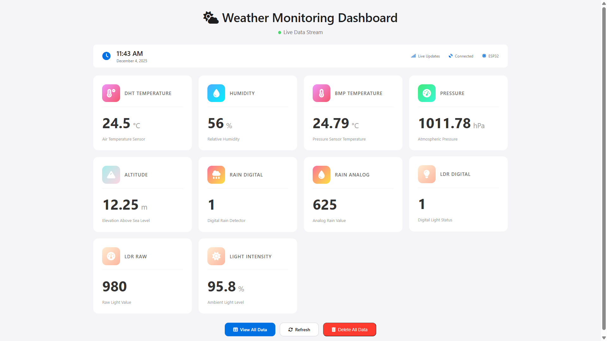
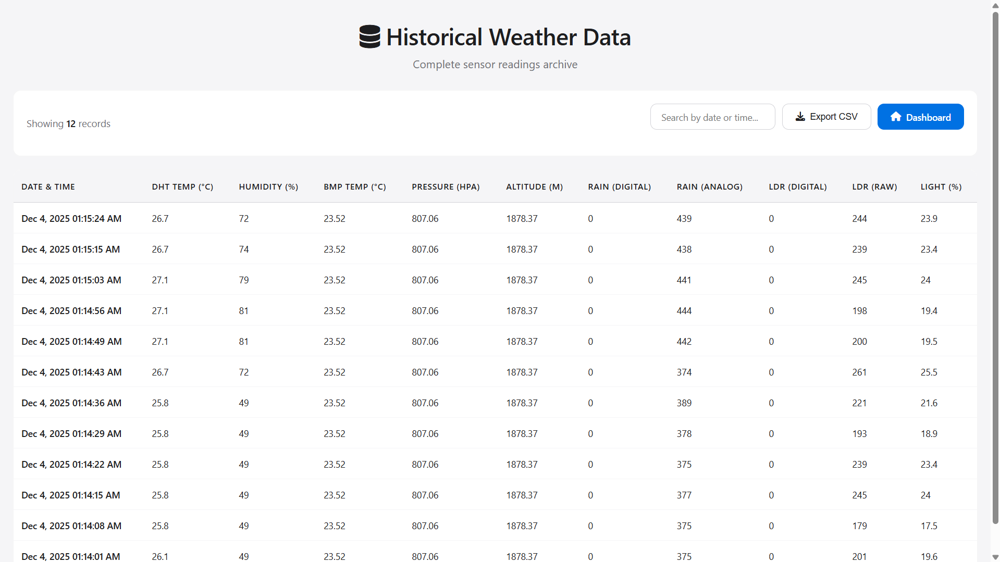

# Weather Monitoring Station


## 📋 Overview

A comprehensive IoT weather monitoring system combining Arduino Uno for sensor data acquisition and NodeMCU ESP8266 for cloud connectivity. The system collects multi-parameter environmental data including temperature, humidity, atmospheric pressure, altitude, rainfall, and light intensity, storing everything in Firebase Realtime Database with timestamp-based organization.

### Why Both Arduino Uno and NodeMCU?

**NodeMCU ESP8266** has excellent WiFi capabilities but comes with a limitation - it has **fewer available pins** compared to Arduino Uno. To handle multiple sensors (DHT11, BMP280, Rain sensor, LDR) simultaneously while maintaining reliable I2C communication and analog inputs, we need more GPIO pins than NodeMCU can provide.

**Solution:** Use Arduino Uno as a dedicated sensor hub with its 14 digital pins and 6 analog inputs, then transmit processed data to NodeMCU via simple **one-way serial communication** (TX only). This architecture provides:
- ✅ Sufficient pins for all sensors
- ✅ Reliable I2C communication (dedicated hardware pins A4/A5)
- ✅ Multiple analog inputs (A0, A1) without conflicts
- ✅ NodeMCU focuses solely on WiFi/Firebase operations
- ✅ Clean separation of concerns (sensing vs. networking)
- ✅ Simplified wiring - only 2 connections needed (Arduino TX → NodeMCU D1, and GND)

### Why Both Arduino Uno and NodeMCU?

**NodeMCU ESP8266** has excellent WiFi capabilities but comes with a limitation - it has **fewer available pins** compared to Arduino Uno. To handle multiple sensors (DHT11, BMP280, Rain sensor, LDR) simultaneously while maintaining reliable I2C communication and analog inputs, we need more GPIO pins than NodeMCU can provide.

**Solution:** Use Arduino Uno as a dedicated sensor hub with its 14 digital pins and 6 analog inputs, then transmit processed data to NodeMCU via simple serial communication. This architecture provides:
- ✅ Sufficient pins for all sensors
- ✅ Reliable I2C communication (dedicated hardware pins A4/A5)
- ✅ Multiple analog inputs (A0, A1) without conflicts
- ✅ NodeMCU focuses solely on WiFi/Firebase operations
- ✅ Clean separation of concerns (sensing vs. networking)

## ✨ Key Features

- 🌡️ **Dual Temperature Sensors:** DHT11 and BMP280 for cross-validation
- 💧 **Humidity Monitoring:** Relative humidity measurement
- 🌤️ **Atmospheric Pressure:** Barometric pressure in hPa
- 🏔️ **Altitude Calculation:** Based on pressure readings
- 🌧️ **Rain Detection:** Both digital and analog rain sensing
- ☀️ **Light Measurement:** LDR-based light intensity (percentage)
- 📊 **Historical Data:** Complete data logging with timestamps
- 📱 **Dual Dashboard:** Live monitoring and historical data views
- 📥 **CSV Export:** Download historical data for analysis
- 🔄 **Real-time Sync:** Automatic cloud synchronization every 30 seconds

## 🔧 Hardware Requirements

### Components List

| Component | Quantity | Specification | Interface |
|-----------|----------|---------------|-----------|
| Arduino Uno | 1 | ATmega328P | Master Controller |
| NodeMCU ESP8266 | 1 | WiFi Module | Cloud Gateway |
| DHT11 Sensor | 1 | Temperature & Humidity | Digital |
| BMP280 Sensor | 1 | Pressure & Temperature | I2C |
| Rain Sensor Module | 1 | FC-37 or equivalent | Digital + Analog |
| LDR Module | 1 | Light Dependent Resistor | Analog |
| Resistors | - | 10kΩ (DHT pull-up) | - |
| Breadboard | 2 | Large size recommended | - |
| Jumper Wires | - | M-M, M-F, F-F | - |
| USB Cables | 2 | Type-A to Type-B (Uno), Micro USB (NodeMCU) | - |
| Power Supply | 1-2 | 5V 2A recommended | - |

## Pin Configuration

### Arduino Uno Connections

| Component Section | Component Pin | Arduino Pin | Type | Notes |
|-------------------|---------------|-------------|------|-------|
| **DHT11 Sensor** | | | | |
| VCC | VCC | 5V | Power | Connect to 5V rail |
| Data | OUT | D2 | Digital | 10kΩ pull-up to 5V required |
| GND | GND | GND | Ground | Connect to GND rail |
| | | | | |
| **BMP280 Sensor (I2C)** | | | | |
| VCC | VIN | 3.3V | Power | Use 3.3V only (not 5V tolerant) |
| GND | GND | GND | Ground | Connect to GND rail |
| SCL | SCL | A5 | I2C Clock | I2C clock line |
| SDA | SDA | A4 | I2C Data | I2C data line |
| | | | | |
| **Rain Sensor Module** | | | | |
| VCC | VCC | 5V | Power | Connect to 5V rail |
| GND | GND | GND | Ground | Connect to GND rail |
| DO | DO | D5 | Digital | Digital output (wet/dry) |
| AO | AO | A0 | Analog | Analog output (0-1023) |
| | | | | |
| **LDR Module** | | | | |
| VCC | VCC | 5V | Power | Connect to 5V rail |
| GND | GND | GND | Ground | Connect to GND rail |
| AO | AO | A1 | Analog | Analog output (0-1023) |
| | | | | |
| **Serial Connection to NodeMCU** | | | | |
| Arduino TX | TX | D1 | Serial TX | To NodeMCU D1 (GPIO5) |
| | | | | |
| **Power Supply** | | | | |
| External DC | - | VIN | Power | 7-12V DC adapter (recommended) |
| Common Ground | - | GND | Ground | Shared with NodeMCU (required) |

### NodeMCU ESP8266 Connections

| Component | Component Pin | NodeMCU Pin | GPIO | Function |
|-----------|---------------|-------------|------|----------|
| **Serial from Arduino** |
| Arduino TX | - | D1 | GPIO5 | Software Serial RX (receives data) |
| **Power** |
| Arduino GND | GND | GND | - | Common ground (required for serial) |
| USB/Adapter | VIN | VU/VIN | - | 5V power input |

### I2C Address Configuration

| Sensor | Default Address | Alternate Address |
|--------|----------------|-------------------|
| BMP280 | 0x76 | 0x77 (SDO to VCC) |

## 🖼️ System Architecture

```
┌─────────────────────────────────────────────────────────────────┐
│                      WEATHER MONITORING SYSTEM                  │
└─────────────────────────────────────────────────────────────────┘

┌──────────────────────┐                  ┌────────────────────────┐
│   ARDUINO UNO        │   Serial UART    │   NodeMCU ESP8266      │
│   (Sensor Hub)       │ ◄─────────────► │   (WiFi Gateway)       │
│                      │   9600 baud      │                        │
│  ┌────────────────┐  │                  │   ┌──────────────┐     │
│  │ DHT11 (D2)     │  │                  │   │ WiFi Module  │     │
│  │ Temp/Humidity  │  │                  │   │ (Built-in)   │     │
│  └────────────────┘  │                  │   └──────┬───────┘     │
│                      │                  │          │             │
│  ┌────────────────┐  │                  │          ▼             │
│  │ BMP280 (I2C)   │  │                  │    ┌──────────┐        │
│  │ Pressure/Temp  │  │                  │    │ Internet │        │
│  │ Altitude       │  │                  │    └────┬─────┘        │
│  └────────────────┘  │                  │         │              │
│                      │                  │         ▼              │
│  ┌────────────────┐  │                  │  ┌────────────────┐   │
│  │ Rain Sensor    │  │                  │  │ Firebase RTDB  │   │
│  │ (D5, A0)       │  │                  │  │ Time-Series DB │   │
│  └────────────────┘  │                  │  └────────────────┘   │
│                      │                  │         │              │
│  ┌────────────────┐  │                  │         ▼              │
│  │ LDR (A1)       │  │                  │  ┌────────────────┐   │
│  │ Light Sensor   │  │                  │  │ Web Dashboard  │   │
│  └────────────────┘  │                  │  │ - index.html   │   │
│                      │                  │  │ - all_data.html│   │
└──────────────────────┘                  └────────────────────────┘
```

## 🔌 Detailed Circuit Diagram

```
ARDUINO UNO                                    NodeMCU ESP8266
┌─────────────┐                               ┌──────────────┐
│             │                               │              │
│ 5V  ────────┼───┬───┬───┬──── DHT11 VCC    │ VU ◄─── 5V   │
│             │   │   │   │                   │              │
│ 3.3V ───────┼───┼───┼───┼──── BMP280 VIN   │ 3V3          │
│             │   │   │   │                   │              │
│ GND ────────┼───┴───┴───┴──── ALL GND ─────┼─── GND       │
│             │   │   │   │                   │              │
│ D2  ────────┼───┘   │   │     DHT11 DATA   │              │
│             │       │   │     (10kΩ to 5V) │              │
│ A4 (SDA) ───┼───────┘   │     BMP280 SDA   │              │
│ A5 (SCL) ───┼───────────┘     BMP280 SCL   │              │
│             │                               │              │
│ D5  ────────┼────── Rain Digital            │              │
│ A0  ────────┼────── Rain Analog             │              │
│ A1  ────────┼────── LDR Analog              │              │
│             │                               │              │
│ D1 (TX) ────┼───────────────────────────────┼─── D1 (RX)   │
│ GND ────────┼───────────────────────────────┼─── GND       │
│             │  One-way Serial (RX only)     │              │
└─────────────┘     9600 baud                 └──────────────┘
```

## 🖥️ Software Setup

### 1. Arduino IDE Configuration

**For Arduino Uno:**
```
Board: "Arduino Uno"
Port: COM[X] (your Arduino port)
Programmer: "AVRISP mkII"
```

**For NodeMCU ESP8266:**
```
Board: "NodeMCU 1.0 (ESP-12E Module)"
Upload Speed: 115200
CPU Frequency: 80 MHz
Flash Size: 4MB (FS:2MB OTA:~1019KB)
Port: COM[Y] (your NodeMCU port)
```

### 2. Required Libraries

**Arduino Uno Libraries:**
```
- Wire (Built-in)
- Adafruit_BMP280 by Adafruit
- DHT sensor library by Adafruit
- Adafruit Unified Sensor (dependency)
```

**NodeMCU Libraries:**
```
- ESP8266WiFi (Built-in with ESP8266 board package)
- WiFiClientSecure (Built-in)
- NTPClient by Fabrice Weinberg
- WiFiUdp (Built-in)
- SoftwareSerial (Built-in)
```

**Installation:**
1. Arduino IDE → Tools → Manage Libraries
2. Search for each library name
3. Click Install

### 3. Firebase Setup

1. Visit [Firebase Console](https://console.firebase.google.com/)
2. Create new project or use existing
3. Enable Realtime Database
4. Get Database URL (format: `your-project.firebaseio.com`)
5. Set rules (development):
```json
{
  "rules": {
    "readings": {
      ".read": true,
      ".write": true
    }
  }
}
```

### 4. Configuration

**Update `NodeMCU.ino`:**
```cpp
const char* ssid = "YOUR_WIFI_SSID";
const char* password = "YOUR_WIFI_PASSWORD";
const char* FIREBASE_HOST = "your-project.firebaseio.com";
const char* FIREBASE_AUTH = ""; // Optional
```

**Update `index.html` and `all_data.html`:**
```javascript
const firebaseConfig = {
    apiKey: "YOUR_API_KEY",
    authDomain: "YOUR_PROJECT.firebaseapp.com",
    databaseURL: "https://YOUR_PROJECT.firebaseio.com",
    projectId: "YOUR_PROJECT_ID",
    storageBucket: "YOUR_PROJECT.appspot.com",
    messagingSenderId: "YOUR_SENDER_ID",
    appId: "YOUR_APP_ID"
};
```

## 📡 Data Protocol

### Serial Communication Format

**Arduino → NodeMCU (CSV format):**
```
<28.5,65.0,28.3,1013.25,45.2,1,512,0,345,33.7>
 │    │    │    │       │    │ │   │ │   │
 │    │    │    │       │    │ │   │ │   └─ LDR %
 │    │    │    │       │    │ │   │ └───── LDR Raw
 │    │    │    │       │    │ │   └─────── LDR Digital
 │    │    │    │       │    │ └─────────── Rain Analog
 │    │    │    │       │    └───────────── Rain Digital
 │    │    │    │       └────────────────── BMP Altitude
 │    │    │    └────────────────────────── BMP Pressure
 │    │    └─────────────────────────────── BMP Temp
 │    └──────────────────────────────────── DHT Humidity
 └───────────────────────────────────────── DHT Temp
```

### Firebase Data Structure

```json
{
  "readings": {
    "2025-12-04T01-15-30+06-00": {
      "ts": 1733268930,
      "dht_temp": 28.5,
      "dht_humi": 65.0,
      "bmp_temp": 28.3,
      "bmp_pres": 1013.25,
      "bmp_alt": 45.2,
      "rain_digital": 1,
      "rain_analog": 512,
      "ldr_digital": 0,
      "ldr_raw": 345,
      "ldr_pct": 33.7
    }
  }
}
```

## 📊 Sensor Specifications

| Sensor | Parameter | Range | Accuracy | Resolution |
|--------|-----------|-------|----------|------------|
| DHT11 | Temperature | 0-50°C | ±2°C | 1°C |
| DHT11 | Humidity | 20-90% | ±5% | 1% |
| BMP280 | Temperature | -40-85°C | ±1°C | 0.01°C |
| BMP280 | Pressure | 300-1100 hPa | ±1 hPa | 0.16 Pa |
| BMP280 | Altitude | -500-9000m | ±1m | - |
| Rain | Analog | 0-1023 | - | 10-bit |
| LDR | Analog | 0-1023 | - | 10-bit |

## 🚀 Upload & Deployment

### Step 1: Upload Arduino Code
1. Connect Arduino Uno via USB
2. Open `Arduino/Arduino.ino`
3. Select Board: "Arduino Uno"
4. Select correct COM port
5. Click Upload
6. Verify serial output (9600 baud)

### Step 2: Upload NodeMCU Code
1. Connect NodeMCU via USB (disconnect Arduino RX/TX first)
2. Open `NodeMCU/NodeMCU.ino`
3. Update WiFi credentials
4. Select Board: "NodeMCU 1.0"
5. Click Upload
6. Verify WiFi connection (115200 baud)

### Step 3: Connect Hardware
1. Power off both devices
2. Connect TX/RX lines between Arduino and NodeMCU
3. Ensure common ground
4. Power on Arduino first, then NodeMCU
5. Monitor serial outputs

### Step 4: Deploy Web Dashboard
1. Host `index.html` and `all_data.html` on web server
2. Or open directly in browser (file:// protocol)
3. Verify Firebase connection
4. Check live data updates

## 📱 Dashboard Features

### Live Dashboard (`index.html`)
- **Real-time Display:** Latest sensor readings
- **Current Time:** NTP-synchronized timestamp
- **8 Data Cards:**
  - DHT Temperature
  - DHT Humidity
  - BMP Temperature
  - Atmospheric Pressure
  - Calculated Altitude
  - Rain Detection (Digital + Analog)
  - Light Level (Digital + Raw + Percentage)
- **Danger Zone:** Delete all readings option

### Historical View (`all_data.html`)
- **Complete Data Table:** All recorded readings
- **Search Filter:** Find by date/time
- **Export Function:** Download CSV
- **Sortable Columns:** All 11 parameters
- **Record Counter:** Total entries displayed
- **Responsive Design:** Mobile-friendly

## 📸 Project Screenshots


*Real-time weather monitoring dashboard with live sensor data*


*Complete circuit assembly showing Arduino, NodeMCU, and all sensors*


*Historical data viewer with search and export capabilities*

## 🛠️ Troubleshooting

| Issue | Cause | Solution |
|-------|-------|----------|
| BMP280 not detected | Wrong I2C address | Try 0x77 in code, check SDO pin |
| DHT reads NaN | Wiring/timing issue | Check connections, add 10kΩ pull-up |
| No serial data on NodeMCU | TX/RX crossed | Swap Arduino TX/RX connections |
| WiFi connection fails | Wrong credentials | Verify SSID/password, use 2.4GHz |
| Firebase upload fails | Network issue | Check internet, verify database URL |
| Timestamp incorrect | NTP sync failed | Check internet, adjust UTC offset |
| Rain sensor always wet | Threshold issue | Adjust threshold in code |
| LDR values erratic | Power noise | Add 0.1μF capacitor across VCC/GND |

## 🔧 Calibration

### BMP280 Sea Level Pressure
```cpp
// In Arduino.ino, update for your location
float bmpAlt = bmp.readAltitude(1013.25); // ← Adjust this value
```

### LDR Threshold
```cpp
// In Arduino.ino
#define LDR_THRESHOLD 500 // Adjust based on your LDR module
```

### Rain Sensor Sensitivity
- Adjust potentiometer on rain sensor module
- Test with water droplets
- Verify digital output triggers correctly

## 📈 Performance Metrics

- **Data Collection Rate:** 30 seconds (configurable)
- **Serial Baud Rate:** 9600
- **Firebase Upload Time:** ~2-3 seconds
- **NTP Sync Interval:** 60 seconds
- **Total Power Consumption:** ~500mA @ 5V
- **Data Retention:** Unlimited (Firebase dependent)

## 💡 Enhancement Ideas

- [ ] Add wind speed/direction sensor
- [ ] Implement UV index measurement
- [ ] Add soil moisture for garden monitoring
- [ ] Create mobile app (Android/iOS)
- [ ] Implement weather predictions using ML
- [ ] Add email/SMS alerts for extreme conditions
- [ ] Solar panel power supply
- [ ] Battery backup with charge controller
- [ ] LoRa communication for remote deployment
- [ ] Local SD card logging for redundancy

## 🔐 Security Best Practices

1. **Production Deployment:**
   - Enable Firebase Authentication
   - Implement secure database rules
   - Use environment variables for secrets
   - Enable HTTPS for web hosting

2. **Database Rules Example:**
```json
{
  "rules": {
    "readings": {
      ".read": "auth != null",
      ".write": "auth != null"
    }
  }
}
```

## 📄 License

Open-source educational project. Free for personal and commercial use.

## 👨‍💻 Author

Weather Monitoring Station IoT Project
Version: 3.0
Last Updated: December 2025

---

**🌦️ Note:** This system is designed for educational purposes and basic weather monitoring. For scientific-grade measurements, consider using calibrated industrial sensors.

**⚡ Power Tip:** For outdoor deployment, use weatherproof enclosures and ensure proper sensor placement for accurate readings.
